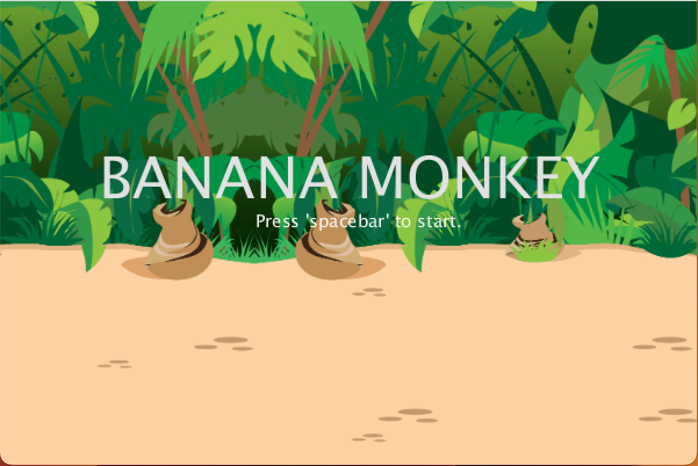

# 2D Processing Game

## Overview

First-year university module submission for **Programming**. A 2D collecting game built with **Processing (Java)**.

---

## Installation / Setup

1. clone the repository
2. open in Processing
3. 'run'

---

## Screenshots

  <table>
    <tr>
      <td align="center">
         
      </td>
      <td align="center">
         
        <td align="center">
         
      </td>
      </td>
    </tr>
  </table>

